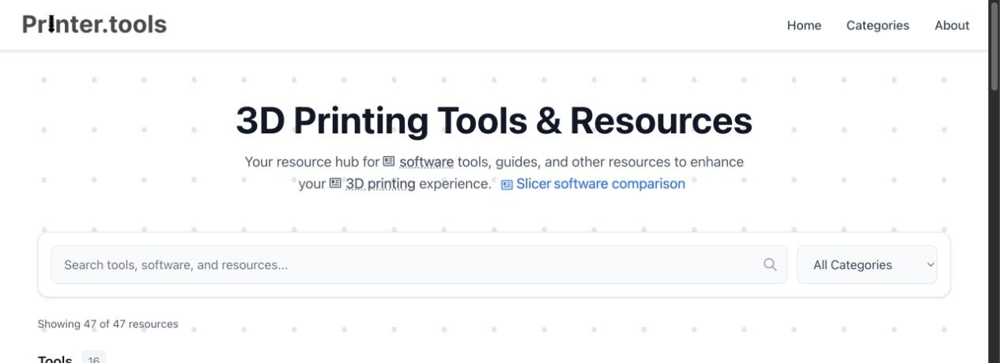
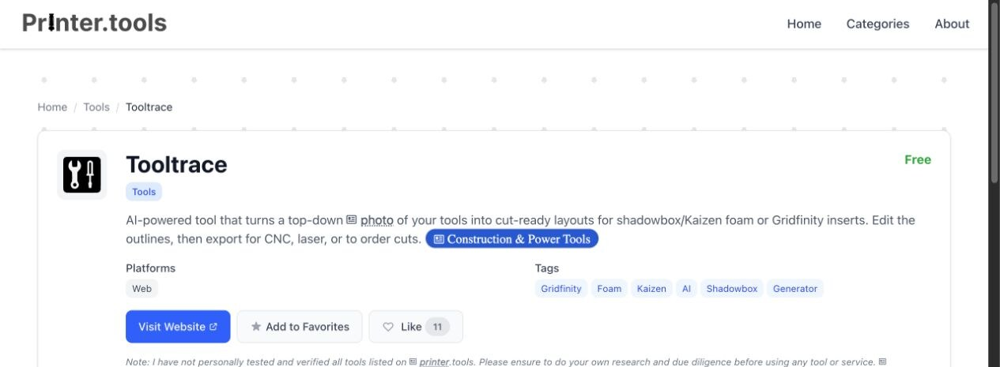

# Printer.tools

[Printer.tools](https://printer.tools) is a curated directory of useful 3D printing software, generators, guides, model libraries, CAD tools, and AI tools.

It helps makers find the right resource, compare options, and save useful tools for quick access.



## What it offers

- Search across resource names, descriptions, and tags
- Filter resources by category
- Browse dedicated category, tag, and resource pages
- Save favorites in the browser for quick access
- Like resources and see popular picks
- Compare Cura, PrusaSlicer, and OrcaSlicer
- Use the free [QR code to STL generator](https://qrcode2stl.printer.tools)

Each resource page includes a short summary, price, supported platforms, tags, and a link to the tool.



## Built with

- [Astro](https://astro.build)
- [React](https://react.dev)
- [Tailwind CSS](https://tailwindcss.com)
- Astro's standalone Node adapter

## Run it locally

You need Node.js 22 or newer and Yarn 1.

```sh
yarn install
yarn dev
```

The local site runs at [http://localhost:4321](http://localhost:4321).

## Commands

| Command | Purpose |
| --- | --- |
| `yarn dev` | Start the local development server |
| `yarn build` | Build the production site in `dist/` |
| `yarn preview` | Preview the production build |
| `yarn astro ...` | Run Astro CLI commands |

## Add or update a resource

Resource data lives in [`src/data/resources.js`](src/data/resources.js). Each entry can include its name, links, descriptions, category, price, platforms, tags, icon, and screenshot.

Store matching images in:

- `public/icons/`
- `public/screenshots/`

Then run `yarn build` to check the site and generated pages.

## Suggest a resource

Send suggestions and fixes to [printertools@flxn.de](mailto:printertools@flxn.de).

## License

Copyright Felix Stein. No open-source license has been granted for this repository.
